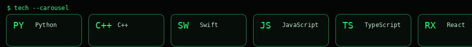

<div align="center">


<br>


<br><br>


</div>

---

```text
┌──[ github@profile ]─[ ~ ]
└─$ ./system_stats
```

<div align="center">


<br>


</div>

---

```text
┌──[ github@profile ]─[ ~ ]
└─$ ./tech-stack --carousel
```

<div align="center">

</div>

---

```text
┌──[ github@profile ]─[ ~ ]
└─$ ./activity
```

<div align="center">


</div>

```text
└─$ exit

connection closed.
```

<div align="center">

</div>
